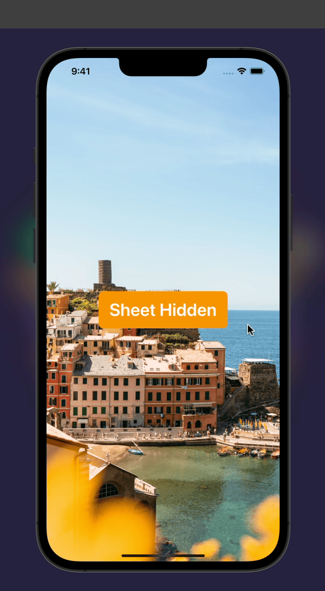
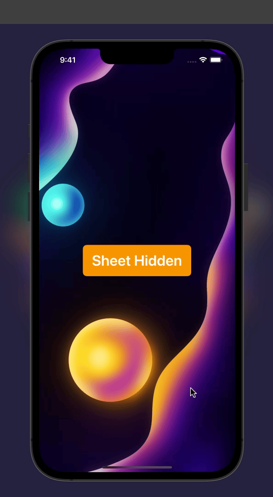
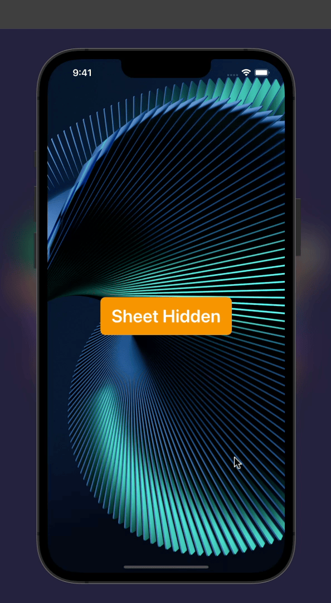

# SplitSheet

A lightweight, fully interactive split-screen sheet.

- Powered by [`UIScrollView`](https://developer.apple.com/documentation/uikit/uiscrollview) for super-smooth gestures.
- Show/hide either programmatically or with a swipe gesture.
- Gestures are fully interruptible.
- Won't affect buttons and gestures nested in subviews.
- Supports sizing detents (hidden, shown, expanded).
- Super simple (~300 lines of code).
- iOS 9+. 

https://user-images.githubusercontent.com/49819455/172063485-9cf70388-cad3-4c79-97ec-e73a176e73d8.mp4

### Showcase

|  |  |  |
|---|---|---|


### Installation
Requires iOS 9+. SplitSheet can be installed through the [Swift Package Manager](https://developer.apple.com/documentation/swift_packages/adding_package_dependencies_to_your_app) (recommended) or manually.

<table>
<tr>
<td>
<strong>
Swift Package Manager
</strong>
<br>
Add the Package URL:
</td>
<td>
<strong>
Manual
</strong>
<br>
Drag <a href="https://github.com/aheze/SplitSheet/blob/main/Sources/SplitSheet.swift">this file</a> into your project:
</td>
</tr>
  
<tr>
<td>
<br>

```
https://github.com/aheze/SplitSheet
```
</td>
<td>
<br>

```
Sources/SplitSheet.swift
```
</td>
</tr>
</table>


### Usage

```swift
import Combine
import SplitSheet
import UIKit

class ViewController: UIViewController {
    let mainViewController = MainViewController()
    let sheetViewController = SheetViewController()
    lazy var splitSheetController = SplitSheetController(
        mainViewController: mainViewController,
        sheetViewController: sheetViewController
    )

    override var childForStatusBarStyle: UIViewController? {
        return splitSheetController
    }

    override func viewDidLoad() {
        super.viewDidLoad()

        /// If true, `mainViewController` will shift up as the sheet is shown.
        splitSheetController.displaceContent = true

        /// Show a grabber handle.
        splitSheetController.showHandle = true

        /// The minimum sheet height.
        splitSheetController.minimumSheetHeight = CGFloat(400)

        /// When the sheet is shown and dragged within this limit, the sheet will bounce back.
        splitSheetController.snappingDistance = CGFloat(150)

        /// How long the show/hide animation takes.
        splitSheetController.animationDuration = CGFloat(0.6)

        /// If swiping up to show the sheet is allowed or not.
        splitSheetController.swipeUpToShowAllowed = true

        /// Override the status bar color.
        splitSheetController.statusBarStyle = UIStatusBarStyle.default
        
        /// Add the sheet.
        embed(splitSheetController, inside: view)
    }
}
```

### Author
Popovers is made by [aheze](https://github.com/aheze).

### Contributing
All contributions are welcome. Just [fork](https://github.com/aheze/SplitSheet/fork) the repo, then make a pull request.

### Need Help?
Open an [issue](https://github.com/aheze/SplitSheet/issues) or join the [Discord server](https://discord.com/invite/Pmq8fYcus2). You can also ping me on [Twitter](https://twitter.com/aheze0). Or read the source code — there's lots of comments.

### Apps Using SplitSheet

[Find](http://getfind.app) is an app that lets you find text in real life. SplitSheet is currently used for the camera gallery view / info sheet — download to check it out!

<a href="http://getfind.app">
  
</a>

If you have an app that uses Popovers, just make a PR or [message me](https://twitter.com/aheze0).

### License

```
MIT License

Copyright (c) 2022 A. Zheng

Permission is hereby granted, free of charge, to any person obtaining a copy
of this software and associated documentation files (the "Software"), to deal
in the Software without restriction, including without limitation the rights
to use, copy, modify, merge, publish, distribute, sublicense, and/or sell
copies of the Software, and to permit persons to whom the Software is
furnished to do so, subject to the following conditions:

The above copyright notice and this permission notice shall be included in all
copies or substantial portions of the Software.

THE SOFTWARE IS PROVIDED "AS IS", WITHOUT WARRANTY OF ANY KIND, EXPRESS OR
IMPLIED, INCLUDING BUT NOT LIMITED TO THE WARRANTIES OF MERCHANTABILITY,
FITNESS FOR A PARTICULAR PURPOSE AND NONINFRINGEMENT. IN NO EVENT SHALL THE
AUTHORS OR COPYRIGHT HOLDERS BE LIABLE FOR ANY CLAIM, DAMAGES OR OTHER
LIABILITY, WHETHER IN AN ACTION OF CONTRACT, TORT OR OTHERWISE, ARISING FROM,
OUT OF OR IN CONNECTION WITH THE SOFTWARE OR THE USE OR OTHER DEALINGS IN THE
SOFTWARE.
```
